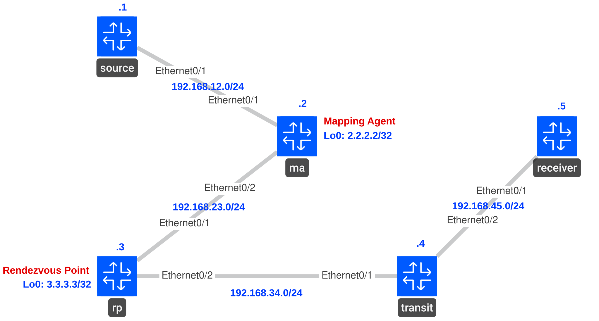

# Multicast Auto-RP

## Goal

* All IP addresses, OSPF routing and PIM-SM have been preconfigured for you.
* Configure AutoRP.
* Joker's Loopback0 is the Rendezvous Point (RP).
* Catwoman's Loopback0 is the Mapping Agent (MP).
* Configure Batman's Ethernet0/1 to join the multicast group 224.4.4.4.
* Make sure you can ping the 224.4.4.4 group address from router Catwoman.

## Topology



## Solutions

**All IP addresses, OSPF routing and PIM-SM have been preconfigured for you.**
```
# All Routers
show ip interface brief
show ip ospf neighbor
show ip pim neighbor
```

**Configure AutoRP.**
```
# All Routers
configure terminal

ip pim autorp listener

end
```

**Joker's Loopback0 is the Rendezvous Point (RP).**
```
# joker
configure terminal

ip pim send-rp-announce Loopback0 scope 20

end
```

**Catwoman's Loopback0 is the Mapping Agent (MP).**
```
# catwoman
configure terminal

ip pim send-rp-discovery Loopback0 scope 20

end
```

**Configure Batman's Ethernet0/1 to join the multicast group 224.4.4.4.**
```
# batman
configure terminal

interface Ethernet0/1
 ip igmp join-group 224.1.1.1

end
```

**Make sure you can ping the 224.4.4.4 group address from router Catwoman.**
```
# catwoman
ping 224.1.1.1 repeat 5
```

## Verification

**All IP addresses, OSPF routing and PIM-SM have been preconfigured for you.**

All routers:

```text
show ip interface brief
show ip ospf neighbor
show ip pim neighbor
```

**Configure AutoRP.**

All routers:

```text
show ip pim autorp
```

**Joker's Loopback0 is the Rendezvous Point (RP).**

All routers—look for RP `2.2.2.2`:

```text
show ip pim rp mapping
```

**Catwoman's Loopback0 is the Mapping Agent (MP).**

Batman—look for information source `1.1.1.1`, via Auto-RP:

```text
show ip pim rp mapping
```

**Configure Batman's Ethernet0/1 to join the multicast group.**

Batman—look for membership on Ethernet0/1:

```text
show ip igmp groups 224.1.1.1
```

**Make sure you can ping the group address from Catwoman.**

Catwoman:

```text
ping 224.1.1.1 repeat 5
```