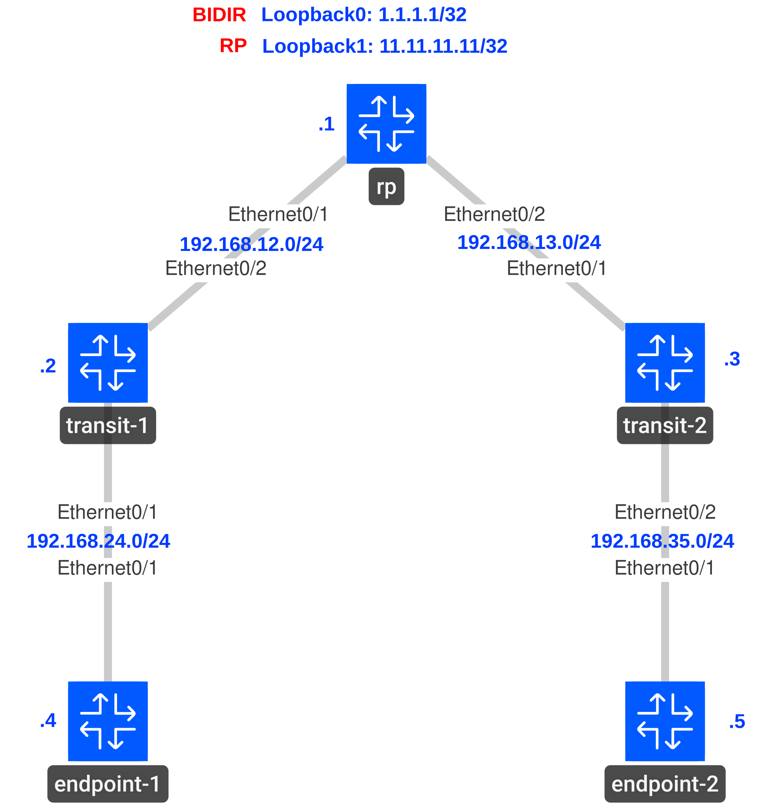

# Multicast Bidirectional PIM

## Goal

* All IP addresses, OSPF routing and PIM-SM have been preconfigured for you.
* Configure manual Rendezvous Points on rp, transit-1, and transit-2.
  * rp's Loopback0 is the bidirectional RP for **only** `239.1.1.1`.
  * rp's Loopback1 is the ordinary sparse-mode RP for **only** `239.2.2.2`.
* Configure both endpoint-1 and endpoint-2 to join `239.1.1.1` and `239.2.2.2` on `Ethernet0/1`.
* Ping both multicast groups from endpoint-1 and endpoint-2.

## Topology



## Solutions

**rp's Loopback0 is the bidirectional RP for **only** `239.1.1.1`.**
```
# rp, transit-1 & transit-2
configure terminal

ip pim bidir-enable

ip pim rp-address 1.1.1.1 BIDIR_GROUPS bidir

ip access-list standard BIDIR_GROUPS
 10 permit 239.1.1.1

end
```

**rp's Loopback1 is the ordinary sparse-mode RP for **only** `239.2.2.2`.**
```
# rp, transit-1 & transit-2
configure terminal

ip pim rp-address 11.11.11.11 SOURCE_GROUPS

ip access-list standard SOURCE_GROUPS
 10 permit 239.2.2.2

end
```

**Configure both endpoint-1 and endpoint-2 to join `239.1.1.1` and `239.2.2.2` on `Ethernet0/1`.**
```
# endpoint-1 & endpoint-2
configure terminal

interface Ethernet0/1
 ip igmp join-group 239.1.1.1
 ip igmp join-group 239.2.2.2

end
```

## Verification

Verify: <mark>***Reply to request # from 192.168.35.5***</mark>

```
# endpoint-1
ping 239.1.1.1 source Ethernet0/1 repeat 5
```
```
# endpoint-1
ping 239.2.2.2 source Ethernet0/1 repeat 5
```

Verify: <mark>***Reply to request # from 192.168.24.4***</mark>

```
# endpoint-2
ping 239.1.1.1 source Ethernet0/1 repeat 5
```
```
# endpoint-2
ping 239.2.2.2 source Ethernet0/1 repeat 5
```

Verify: <mark>***BIDIR_GROUPS → 1.1.1.1, Bidir Mode; SOURCE_GROUPS → 11.11.11.11, Static.***</mark>

```
# rp, transit-1 & transit-2
show ip pim rp mapping
```
Verify: <mark>***B flag, RP 1.1.1.1, upstream Ethernet0/2.***</mark>

```
# transit-1
show ip mroute 239.1.1.1
```

Verify: <mark>***S flag, RP 11.11.11.11, incoming Ethernet0/2.***</mark>

```
# transit-1
show ip mroute 239.2.2.2
```

Verify: <mark>***B flag, RP 1.1.1.1, upstream Ethernet0/1.***</mark>

```
# transit-2
show ip mroute 239.1.1.1
```

Verify: <mark>***S flag, RP 11.11.11.11, incoming Ethernet0/1.***</mark>

```
# transit-2
show ip mroute 239.2.2.2
```