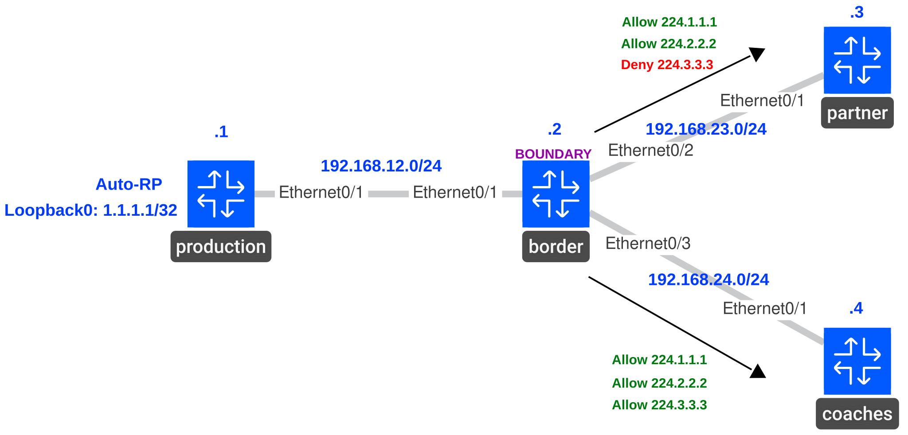

# Multicast Boundary Filtering: Auto-RP Mappings

## Scenario

The Tennessee Titans share live video and replays with a broadcast partner. The partner should learn the RP mappings for those feeds, while the private coaching feed's mapping stays inside the team network.

## Goal

- IP addresses, OSPF, PIM sparse mode, and receiver joins for all three groups are preconfigured.
- On production, make `Loopback0` (`1.1.1.1`) the Auto-RP and mapping agent for all three groups.
- On border, enable the Auto-RP listener. Apply a **standard ACL** multicast boundary with `filter-autorp` on `Ethernet0/2` toward partner. Permit Auto-RP control groups and the mappings for `239.1.1.1` and `239.2.2.2`; exclude `239.3.3.3`.
- Verify partner learns only the first two mappings after they refresh. Coaches should retain all three.

## Topology



| Group | Feed |
| --- | --- |
| `239.1.1.1` | Live video |
| `239.2.2.2` | Replays |
| `239.3.3.3` | Private coaching video |

## Verification

Configure Auto-RP on production first. Before adding the boundary, both receivers should learn all three mappings and answer pings to all three groups.

**Partner and coaches**

```text
show ip pim rp mapping
```

**Production**

```text
ping 239.1.1.1 source Loopback0 repeat 5
```

```text
ping 239.2.2.2 source Loopback0 repeat 5
```

```text
ping 239.3.3.3 source Loopback0 repeat 5
```

Apply the boundary on border. After the Auto-RP mappings refresh, partner should show only the first two; coaches should still show all three.

**Border**

```text
show running-config interface Ethernet0/2
show access-lists PARTNER_RP_GROUPS
```

**Partner and coaches**

```text
show ip pim rp mapping
```

Repeat the three pings from production to compare delivery. A multicast boundary also filters data, so ping results alone do not prove which RP mappings were received.