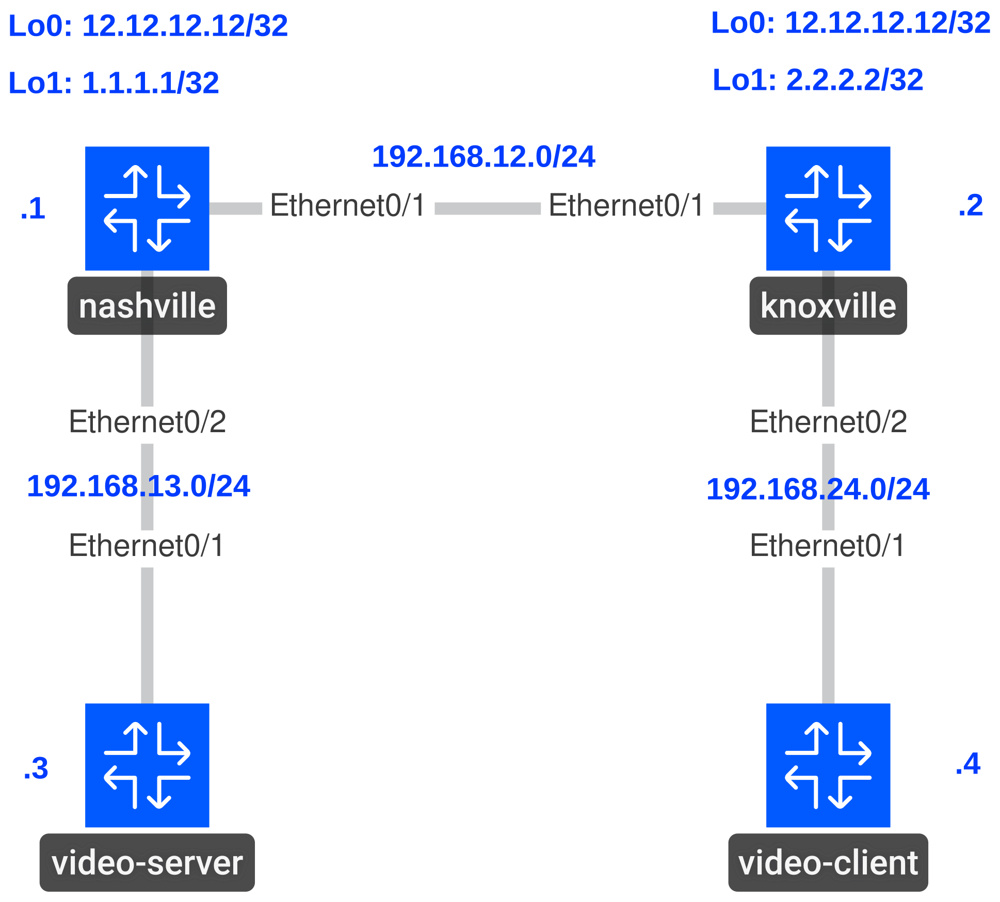

# Multicast MSDP with Anycast RP

## Goal

- IP addresses and OSPF are preconfigured.
- Configure sparse-mode multicast on all of R1 and R2’s interfaces..
- Configure R1 & R2’s Loopback0 as the Anycast RP.
- Configure an MSDP peering between R1 & R2’s Loopback1 interfaces.
- Configure an MSDP SA filter to only permit 239.0.0.0/8 traffic between the MSDP peers.
- Configure R4’s FastEthernet0/0 interface to join both 224.1.1.1 and 239.1.1.1.
- Test your PIM config by pinging from R3. Ensure 224.1.1.1 doesn’t work, but 239.1.1.1 does.

## Topology



| Group | Expected Result |
| --- | --- |
| `224.1.1.1` | Fails |
| `239.1.1.1` | Succeeds |

## Verification

**nashville and knoxville**

Check that the RP is `12.12.12.12` and the MSDP peer state is `Up`.

```text
show ip pim rp mapping
show ip msdp peer
```

**video-server**

Run each ping separately. The video-client (`192.168.24.4`) should reply to `239.1.1.1`; `224.1.1.1` should receive no replies because of the MSDP SA filter. Initial packets may time out while multicast state forms.

```text
ping 239.1.1.1 source Ethernet0/1 repeat 5
```

```text
ping 224.1.1.1 source Ethernet0/1 repeat 5
```
