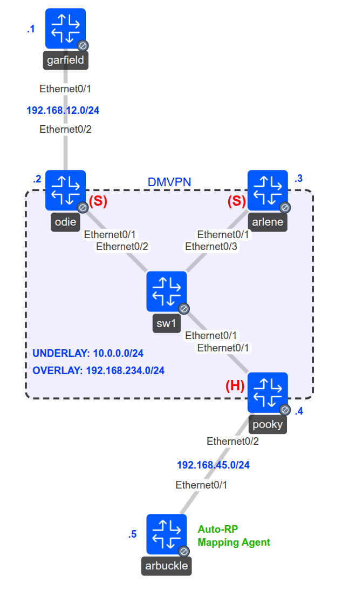

# Multicast PIM NBMA Mode over DMVPN

## Scenario

As a full-time IT instructor at a high school, you want to stream old-school cartoons across the school’s network. The sites connect through a hub-and-spoke DMVPN network, with Pooky serving as the hub and Odie and Arlene serving as spokes.

Arbuckle connects behind Pooky and provides the multicast rendezvous point. Garfield connects behind Odie, while Arlene acts as the multicast receiver.

Your task is to make multicast work from both source locations. Traffic from Garfield must enter Pooky from one spoke and leave toward another through the same multipoint tunnel interface.

This lab uses DMVPN Phase 1 with GRE and NHRP, without IPsec encryption.

## Goal

* Use the following DMVPN topology:

  | Router | Role  | Ethernet0/1 underlay address | Tunnel0 address  |
  | ------ | ----- | ---------------------------- | ---------------- |
  | Pooky  | Hub   | 10.0.0.4/24                  | 192.168.234.4/24 |
  | Odie   | Spoke | 10.0.0.2/24                  | 192.168.234.2/24 |
  | Arlene | Spoke | 10.0.0.3/24                  | 192.168.234.3/24 |

* Use SW1 to provide Ethernet connectivity for the `10.0.0.0/24` underlay.

* Configure a multipoint GRE tunnel on Pooky and point-to-point GRE tunnels toward `10.0.0.4` on Odie and Arlene. Use NHRP network ID `100`, tunnel key `100`, and tunnel IP MTU `1400`.

* Configure EIGRP AS `100` on all five routers. Advertise the tunnel subnet, the Garfield–Odie subnet, the Pooky–Arbuckle subnet, and Arbuckle’s loopback network. Keep the underlay subnet outside EIGRP.

* Disable EIGRP split horizon on Pooky’s `Tunnel0` so routes learned from one spoke can be advertised to the other. Preserve Pooky as the next hop for remote spoke networks.

* Enable multicast routing on all five routers. Configure PIM sparse mode on the tunnel interfaces, the Garfield–Odie and Pooky–Arbuckle links, and Arbuckle’s Loopback0.

* Configure PIM NBMA mode on Pooky’s and Odie’s `Tunnel0` interfaces, matching the working configuration for this lab.

* Configure Arbuckle as the Auto-RP candidate and mapping agent using Loopback0, `5.5.5.5`, with scope `20`.

* Enable Auto-RP listener functionality on all five routers so Auto-RP information can propagate across the sparse-mode network.

* Configure Arlene to join multicast group `224.1.1.1` on `Tunnel0`.

* Verify multicast delivery from Arbuckle:

  ```cisco
  ping 224.1.1.1 source 192.168.45.5 repeat 20
  ```

* Verify spoke-to-spoke multicast delivery from Garfield:

  ```cisco
  ping 224.1.1.1 source 192.168.12.1 repeat 100
  ```

* Confirm sustained replies from Arlene at `192.168.234.3`, rather than only an initial reply.

* On Arlene, verify that RP `5.5.5.5` was learned through Auto-RP:

  ```cisco
  show ip pim rp mapping
  ```

## Topology



## Video Solution

[Original Frame Relay Lab Solution](http://www.youtube.com/watch?v=jBNzfDa5rXk)

The original video accompanies the Frame Relay version of this exercise. This adaptation replaces the Frame Relay network with DMVPN.
