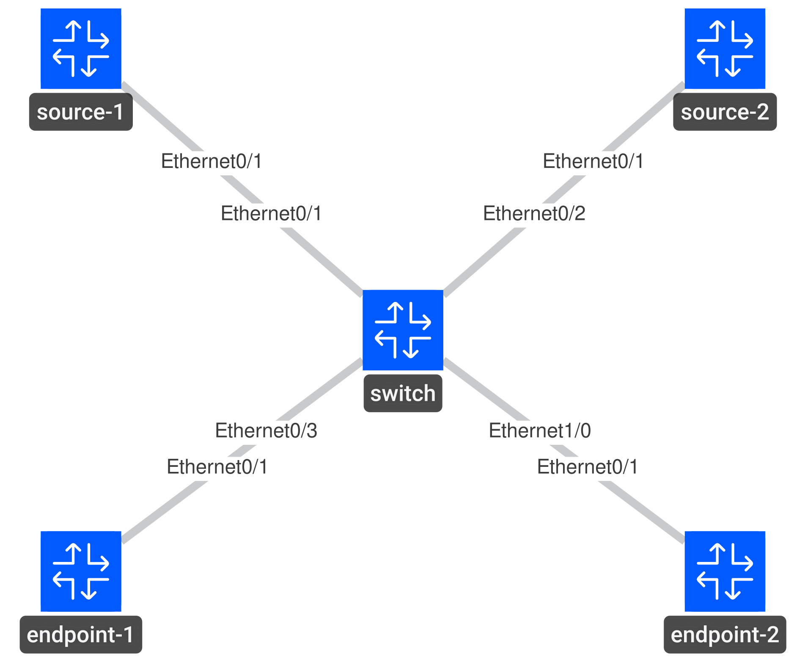

# IGMP Membership

## Goal

- IP addresses, VLAN 10, PIM sparse mode on both routers, and IGMPv2 are preconfigured.
- Verify source-1 is the IGMP querier and source-2 is the PIM Designated Router.
- Configure both receivers to join `239.1.1.1`. Verify both reply to multicast pings.
- Remove endpoint-2's membership. Verify endpoint-1 still replies.
- Remove endpoint-1's membership. Verify the group disappears from both routers after the membership timers complete.
- Verify source-2 takes over as querier when source-1's Ethernet0/1 is shut down. Restore source-1 afterward.

## Topology



## Solutions

**Verify source-1 is the IGMP querier and source-2 is the PIM Designated Router.**
```text
# source-1 & source-2
show ip igmp interface Ethernet0/1
```

**Configure both receivers to join `239.1.1.1`. Verify both reply to multicast pings.**
```text
# endpoint-1 & endpoint-2
configure terminal

interface Ethernet0/1
 ip igmp join-group 239.1.1.1

end
```

**Remove endpoint-2's membership. Verify endpoint-1 still replies.**
```text
# endpoint-2
configure terminal

interface Ethernet0/1
 no ip igmp join-group 239.1.1.1

end
```

**Remove endpoint-1's membership. Verify the group disappears from both routers after the membership timers complete.**
```text
# endpoint-1
configure terminal

interface Ethernet0/1
 no ip igmp join-group 239.1.1.1

end
```

**Verify source-2 takes over as querier when source-1's Ethernet0/1 is shut down. Restore source-1 afterward.**
```text
# source-1
configure terminal

interface Ethernet0/1
 shutdown

end
```

Wait for source-2's querier timeout, then run the failover check below. With default timers, this takes approximately two minutes.

```text
# source-1 — after verifying failover
configure terminal

interface Ethernet0/1
 no shutdown

end
```

## Verification

Run each check immediately after its corresponding solution step.

Verify: <mark>***IGMP version 2; querying router 192.168.10.1; designated router 192.168.10.2.***</mark>
```text
# source-1 & source-2
show ip igmp interface Ethernet0/1
```

Verify: <mark>***After both joins: 239.1.1.1 is present on Ethernet0/1.***</mark>
```text
# source-1 & source-2
show ip igmp groups 239.1.1.1
```

IGMPv2 report suppression means Last Reporter can show either receiver; this table does not list every host.

Verify: <mark>***After both joins: replies from 192.168.10.11 and 192.168.10.12.***</mark>
```text
# source-1
ping 239.1.1.1 source Ethernet0/1 repeat 5
```

Verify: <mark>***After endpoint-2 leaves: replies only from 192.168.10.11.***</mark>
```text
# source-1
ping 239.1.1.1 source Ethernet0/1 repeat 5
```

Verify: <mark>***After both receivers leave and the timers complete: no entry for 239.1.1.1.***</mark>
```text
# source-1 & source-2
show ip igmp groups 239.1.1.1
```

Verify: <mark>***During failover: querying router 192.168.10.2 (this system).***</mark>
```text
# source-2
show ip igmp interface Ethernet0/1
```

Verify: <mark>***After restoration: querying router 192.168.10.1; designated router 192.168.10.2.***</mark>
```text
# source-1 & source-2
show ip igmp interface Ethernet0/1
```
